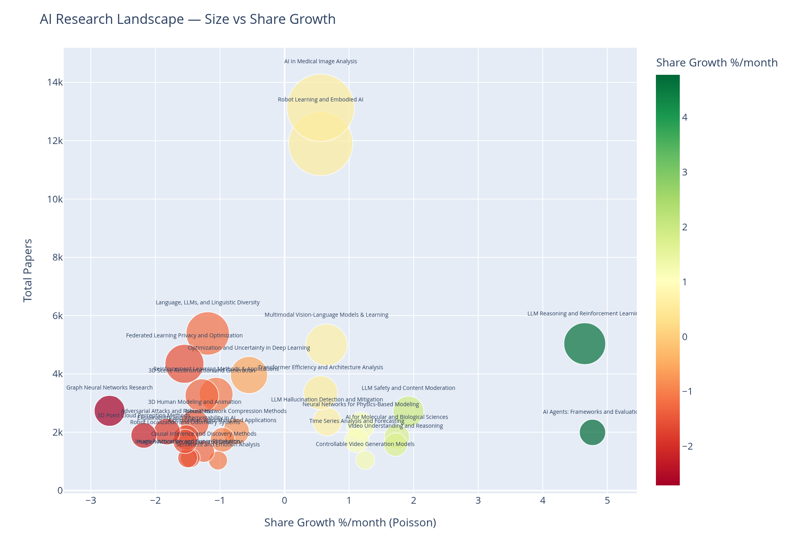
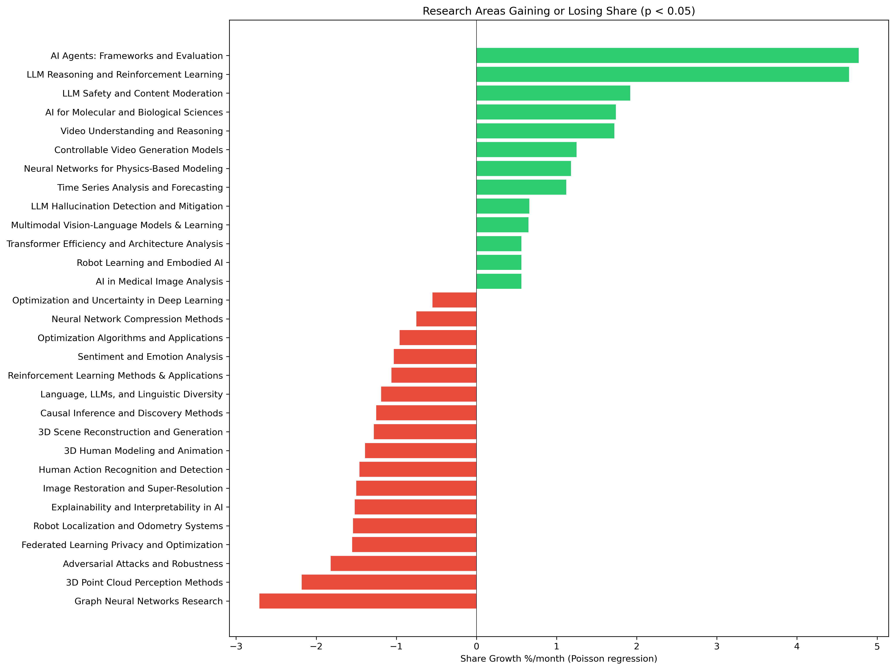
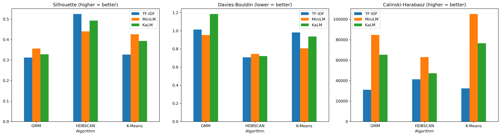

# ArXiv AI Research Trends (2024-2026)

Unsupervised clustering analysis of 181k+ AI research papers from ArXiv to discover and track emerging research trends. Built to help a technology-oriented company identify where to focus academic partnerships and R&D investment.

## What This Project Does

Collects 181,294 AI research papers from ArXiv (Jan 2024 – Feb 2026), clusters them into 39 research topics using unsupervised learning, and identifies which areas are growing or declining. The pipeline:

1. **Collects** papers from 8 ArXiv CS categories via the ArXiv API
2. **Embeds** abstracts using TF-IDF, MiniLM, and KaLM sentence transformers
3. **Reduces** dimensionality with SVD + UMAP (tuned via hyperparameter experiment)
4. **Clusters** using K-Means, GMM, and HDBSCAN (9 combinations compared)
5. **Validates** clusters against ArXiv categories and cross-embedding agreement
6. **Measures growth** using Poisson regression controlling for overall ArXiv growth
7. **Delivers** strategic recommendations backed by statistical significance

## Key Findings

**13 of 39 research areas are gaining share. 17 are losing share. AI research is concentrating.**



*Each bubble is a research area. X-axis: monthly share growth. Y-axis: cluster size. Top-right quadrant = large and accelerating (safe bets); top-left = large and cooling (legacy); bottom-right = small and accelerating (emerging plays).*

### Fastest Growing (share growth, p < 0.05)
| Research Area | Papers | Growth %/month |
|---------------|--------|----------------|
| AI Agents: Frameworks and Evaluation | 1,994 | +4.77% |
| LLM Reasoning and Reinforcement Learning | 5,037 | +4.65% |
| LLM Safety and Content Moderation | 2,714 | +1.92% |
| AI for Molecular and Biological Sciences | 1,837 | +1.74% |
| Video Understanding and Reasoning | 1,573 | +1.72% |
| AI in Medical Image Analysis | 13,129 | +0.56% |
| Robot Learning and Embodied AI | 11,898 | +0.56% |

### Fastest Declining
| Research Area | Papers | Growth %/month |
|---------------|--------|----------------|
| Graph Neural Networks Research | 2,734 | -2.71% |
| 3D Point Cloud Perception Methods | 1,891 | -2.18% |
| Adversarial Attacks and Robustness | 2,019 | -1.82% |
| Federated Learning Privacy and Optimization | 4,348 | -1.55% |
| Robot Localization and Odometry Systems | 1,685 | -1.54% |



### Noise Decomposition
- **64.3%** of papers assigned to 39 main clusters
- **18.1%** are small niche topics below the clustering threshold (e.g. financial AI, continual learning, traffic modeling)
- **17.5%** are genuinely interdisciplinary papers

## Method

- 3 embedding types (TF-IDF, MiniLM, KaLM) x 3 clustering algorithms (K-Means, GMM, HDBSCAN) = 9 combinations
- UMAP dimensionality reduction with hyperparameter tuning (40d won over 20d)
- Evaluated with silhouette, Davies-Bouldin, Calinski-Harabasz, and topic coherence (c_v)
- Validated with ARI/NMI against ArXiv categories and cross-embedding agreement
- Growth trends measured with Poisson regression (offset by total monthly volume)
- All reported trends are statistically significant (p < 0.05)

**Best combination:** KaLM embeddings + HDBSCAN (39 clusters, silhouette 0.493, Davies-Bouldin 0.722, 35.7% noise)



## Project Structure

```
notebooks/
  01_data_collection.ipynb          — ArXiv API collection (181k papers)
  02_exploratory_analysis.ipynb     — EDA, category and term distributions
  03_preprocessing.ipynb            — Text cleaning, survey flagging, embeddings
  04_dimensionality_reduction.ipynb — SVD baseline, UMAP reduction and tuning
  05_clustering.ipynb               — K-Means, GMM, HDBSCAN comparison
  06_validation.ipynb               — Noise analysis, ARI/NMI, cross-embedding agreement
  07_trends_and_insights.ipynb      — Growth analysis, recommendations

src/
  collect.py       — ArXiv API data collection with checkpointing
  preprocess.py    — Text cleaning, filtering, lemmatization
  features.py      — TF-IDF, embeddings, UMAP, topic coherence
  label.py         — Cluster labeling via Claude Opus API

tests/             — Smoke tests for pure functions in src/
data/              — Raw and processed data (gitignored, regenerated by pipeline)
figures/           — Exported visualizations
```

## Running Tests

```bash
pytest tests/
```

## Getting Started

```bash
git clone https://github.com/dinosmuc/arxiv-ai-trends.git
cd arxiv-ai-trends

conda env create -f environment.yml
conda activate arxiv-trends
pip install -r requirements.txt
python -m spacy download en_core_web_sm

# Optional: set API key for Claude-based cluster labeling
export ANTHROPIC_API_KEY=your-key-here

# Run the full pipeline
jupyter lab notebooks/
# Execute notebooks 01-07 in order
```

## Hardware Requirements

- **GPU:** CUDA-compatible GPU required for sentence-transformer embeddings
  - KaLM embedding: ~2 hours on RTX 2070
  - MiniLM embedding: ~5 minutes
- **RAM:** 32GB recommended
- **Disk:** ~2GB for processed data

## License

MIT
